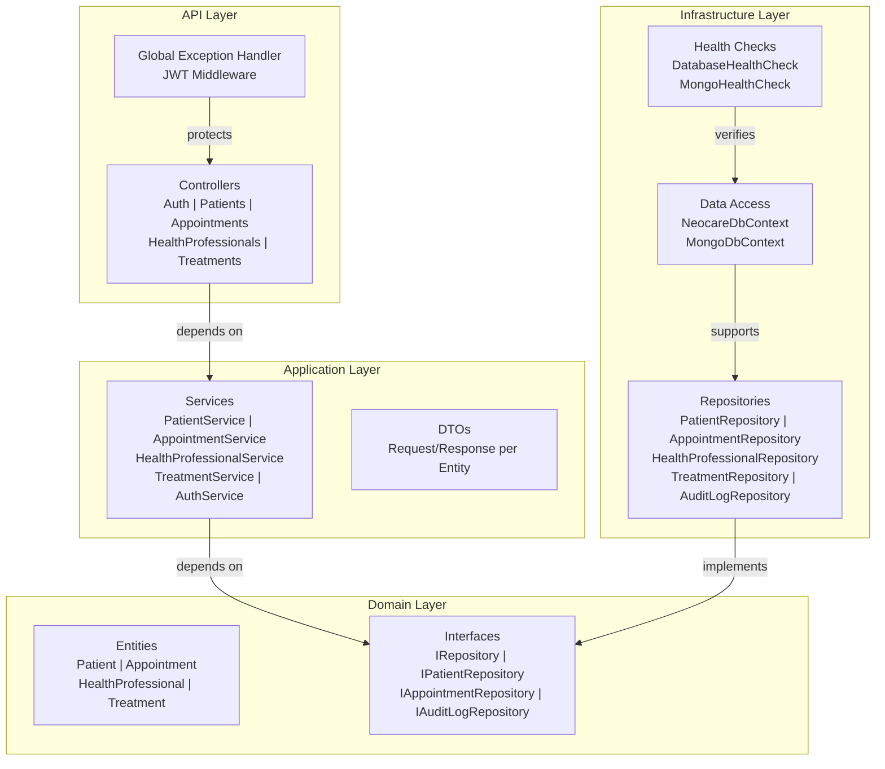

# Neocare API
**Turma:** 2TDSPS-2025

## Integrantes
| Nome                                  | RM       |
|---------------------------------------|----------|
| João dos Santos Cardoso de Jesus      | RM560400 |
| Davi Praxedes Santos Silva            | RM560719 |
| Kauê Vinicius Samartino da Silva      | RM559317 |

## Visão Geral
Neocare é uma API RESTful completa voltada para gestão de cuidados de saúde e pacientes, contemplando:
- **Cadastro de Pacientes**: Gerenciamento de informações pessoais, histórico médico e status de pacientes
- **Agendamento de Consultas**: Marcação de consultas com profissionais de saúde, verificação de disponibilidade de horários
- **Gestão de Profissionais de Saúde**: Cadastro de médicos e especialistas com credenciais (CRM)
- **Acompanhamento de Tratamentos**: Registro de tratamentos, prescrições e evolução de pacientes
- **Auditoria**: Registro em MongoDB de todas as operações (CREATE, UPDATE, DELETE)

## Arquitetura



## Tecnologias
- **.NET 10** - Framework Web
- **Entity Framework Core** - ORM para SQL Server
- **SQL Server** - Banco de dados relacional
- **MongoDB** - Banco de dados NoSQL para auditoria
- **JWT (JSON Web Token)** - Autenticação
- **Serilog** - Logging estruturado
- **Swagger/OpenAPI** - Documentação interativa
- **xUnit** - Framework de testes
- **Moq** - Mocking para testes
- **Health Checks** - Monitoramento de saúde

## Como Executar

### Pré-requisitos
- [.NET 10 SDK](https://dotnet.microsoft.com/download/dotnet/10.0)
- SQL Server 2019+ (ou LocalDB)
- MongoDB 5.0+ (opcional, para auditoria)
- Visual Studio 2025 ou VS Code

### Configuração

1. **Clone o repositório**
```bash
git clone https://github.com/joaocrdso/Neocare-.NET.git
cd Neocare-.NET/Neocare
```

2. **Configure a connection string em `appsettings.json`**
```json
{
  "ConnectionStrings": {
    "DefaultConnection": "Server=localhost;Database=NeocareDb;Trusted_Connection=true;"
  },
  "MongoDbSettings": {
    "ConnectionString": "mongodb://localhost:27017",
    "DatabaseName": "neocare"
  }
}
```

3. **Restaure os pacotes NuGet**
```bash
dotnet restore
```

4. **Aplique as migrations**
```bash
dotnet ef database update
```

5. **Execute a aplicação**
```bash
dotnet run
```

A API estará disponível em: `https://localhost:5001`

## Swagger/OpenAPI
Acesse a documentação interativa em:
```
https://localhost:5001/swagger
```

## Como Testar

### Executar todos os testes
```bash
dotnet test
```

### Executar apenas testes unitários
```bash
dotnet test --filter "Category=Unit"
```

### Executar apenas testes de integração
```bash
dotnet test --filter "Category=Integration"
```

## Endpoints

| Método | Rota | Autenticação | Descrição |
|--------|------|--------------|-----------|
| **AUTH** |
| POST | `/api/auth/register` | ❌ | Registrar novo usuário |
| POST | `/api/auth/login` | ❌ | Fazer login e obter JWT token |
| **PACIENTES** |
| GET | `/api/patients` | ✅ | Listar pacientes com paginação e filtros |
| GET | `/api/patients/{id}` | ✅ | Obter detalhes de um paciente |
| POST | `/api/patients` | ✅ | Criar novo paciente |
| PUT | `/api/patients/{id}` | ✅ | Atualizar paciente |
| DELETE | `/api/patients/{id}` | ✅ | Deletar paciente |
| **PROFISSIONAIS DE SAÚDE** |
| GET | `/api/health-professionals` | ✅ | Listar profissionais com paginação |
| GET | `/api/health-professionals/{id}` | ✅ | Obter detalhes de um profissional |
| POST | `/api/health-professionals` | ✅ | Criar novo profissional |
| PUT | `/api/health-professionals/{id}` | ✅ | Atualizar profissional |
| DELETE | `/api/health-professionals/{id}` | ✅ | Deletar profissional |
| **CONSULTAS** |
| GET | `/api/appointments` | ✅ | Listar consultas com paginação |
| GET | `/api/appointments/{id}` | ✅ | Obter detalhes de uma consulta |
| POST | `/api/appointments` | ✅ | Agendar nova consulta |
| PUT | `/api/appointments/{id}` | ✅ | Atualizar consulta |
| DELETE | `/api/appointments/{id}` | ✅ | Cancelar consulta |
| **TRATAMENTOS** |
| GET | `/api/treatments` | ✅ | Listar tratamentos com paginação |
| GET | `/api/treatments/{id}` | ✅ | Obter detalhes de um tratamento |
| POST | `/api/treatments` | ✅ | Criar novo tratamento |
| PUT | `/api/treatments/{id}` | ✅ | Atualizar tratamento |
| DELETE | `/api/treatments/{id}` | ✅ | Deletar tratamento |
| **HEALTH CHECKS** |
| GET | `/health` | ❌ | Verificar saúde da aplicação |

## Parâmetros de Paginação e Filtros

### Exemplo de requisição com paginação, ordenação e filtros
```
GET /api/patients?pageNumber=1&pageSize=10&name=João&status=Active&orderBy=name&orderDirection=asc
```

**Parâmetros:**
- `pageNumber` - Número da página (padrão: 1)
- `pageSize` - Itens por página (padrão: 10, máx: 100)
- `orderBy` - Campo para ordenação (padrão: Id)
- `orderDirection` - Direção: `asc` ou `desc` (padrão: asc)
- `name` - Filtro por nome (apenas pacientes)
- `status` - Filtro por status (apenas pacientes)

## Formato de Resposta HATEOAS

### Exemplo: GET /api/patients/123
```json
{
  "data": {
    "id": "123e4567-e89b-12d3-a456-426614174000",
    "name": "João Silva",
    "email": "joao@example.com",
    "cpf": "12345678901",
    "phoneNumber": "(11) 98765-4321",
    "dateOfBirth": "1990-05-15T00:00:00Z",
    "address": "Rua A, 123",
    "medicalHistory": "Diabetes tipo 2",
    "status": "Active",
    "createdAt": "2025-01-15T10:00:00Z",
    "updatedAt": "2025-01-15T10:00:00Z"
  },
  "_links": {
    "self": {
      "href": "/api/patients/123",
      "method": "GET"
    },
    "update": {
      "href": "/api/patients/123",
      "method": "PUT"
    },
    "delete": {
      "href": "/api/patients/123",
      "method": "DELETE"
    }
  }
}
```

## Autenticação JWT

1. **Registrar novo usuário**
```bash
curl -X POST https://localhost:5001/api/auth/register \
  -H "Content-Type: application/json" \
  -d '{"email":"user@example.com","password":"Password123!"}'
```

2. **Fazer login**
```bash
curl -X POST https://localhost:5001/api/auth/login \
  -H "Content-Type: application/json" \
  -d '{"email":"user@example.com","password":"Password123!"}'
```

3. **Usar o token em requisições autenticadas**
```bash
curl -X GET https://localhost:5001/api/patients \
  -H "Authorization: Bearer YOUR_JWT_TOKEN"
```

## Health Checks

A API fornece informações sobre sua saúde:
```bash
curl https://localhost:5001/health
```

Resposta:
```json
{
  "status": "Healthy",
  "checks": {
    "sqlserver": "Healthy",
    "mongodb": "Healthy"
  }
}
```

## Logging

Os logs são salvos em:
- **Console**: Saída em tempo real
- **Arquivo**: `logs/neocare-.log` (rotação diária)

Exemplo de log estruturado:
```
[10:30:45 INF] Request started. GET /api/patients
[10:30:45 INF] Executing action PatientsController.GetAll
[10:30:45 INF] Executed action PatientsController.GetAll
[10:30:45 INF] Request finished in 150ms
```

## Estrutura de Pastas

```
Neocare/
├── API/
│   └── Controllers/          → AuthController, PatientsController, etc.
├── Application/
│   ├── DTOs/                 → CreatePatientDto, PatientDto, etc.
│   ├── Interfaces/           → IPatientService, IAuthService, etc.
│   └── Services/             → PatientService, AuthService, etc.
├── Domain/
│   ├── Entities/             → Patient, Appointment, HealthProfessional, Treatment
│   └── Interfaces/           → IRepository, IPatientRepository, etc.
├── Infrastructure/
│   ├── Data/                 → NeocareDbContext
│   ├── Repositories/         → PatientRepository, AppointmentRepository, etc.
│   ├── Persistence/          → MongoDbContext, DbSettings
│   ├── HealthChecks/         → DatabaseHealthCheck, ExternalServiceHealthCheck
│   └── Middleware/           → GlobalExceptionHandlerMiddleware
├── Program.cs                → Configuração e injeção de dependências
├── appsettings.json          → Configurações
└── README.md                 → Este arquivo
```

## Validações e Regras de Negócio

### Pacientes
- Email único e válido
- CPF único e com 11 dígitos
- Data de nascimento válida
- Status: Active, Inactive

### Profissionais de Saúde
- Email único
- CPF único
- CRM único
- Specialty obrigatória

### Consultas
- Não podem ter conflito de horário para o profissional
- Duração mínima de 15 minutos
- Status: Scheduled, Completed, Cancelled

### Tratamentos
- Ligados a uma consulta
- Paciente associado
- Data de início menor que data de fim
- Status: Active, Completed, Cancelled

## Testes

### Estrutura de Testes

**Testes Unitários** (padrão AAA):
- Testam serviços com repositórios mockados
- Validação de regras de negócio
- Verificação de exceções

**Testes de Integração**:
- Testam fluxos completos via HTTP
- Verificam endpoints reais
- Usam banco de dados em memória

## Penalidades Evitadas

- ✅ Projeto compila sem erros ou warnings críticos
- ✅ README completo com integrantes
- ✅ Testes implementados (unitários e integração)
- ✅ Clean Architecture com 4 camadas bem definidas
- ✅ SOLID principles aplicados
- ✅ JWT e autenticação implementada
- ✅ Health Checks funcionais
- ✅ Logging com Serilog
- ✅ HATEOAS nos responses
- ✅ Paginação, ordenação e filtros
- ✅ Global Exception Handler
- ✅ MongoDB para auditoria
- ✅ Migrations do Entity Framework

## Suporte

Para questões ou problemas, abra uma issue no repositório.

---
**Última atualização:** Janeiro de 2025